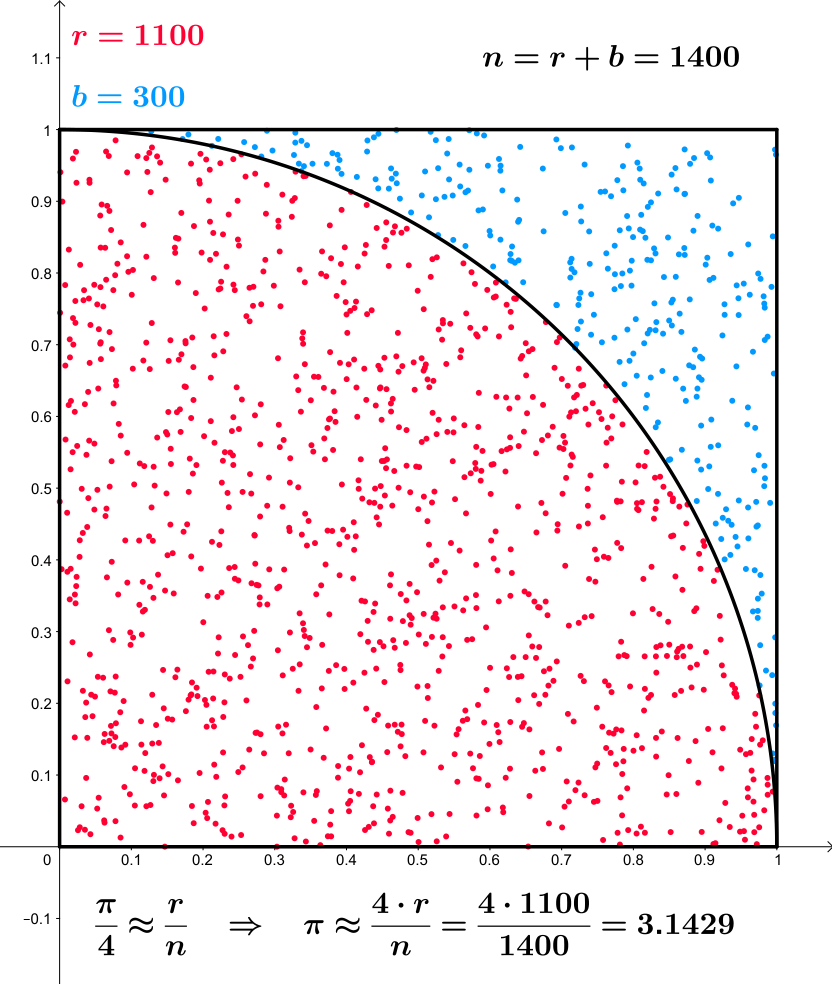
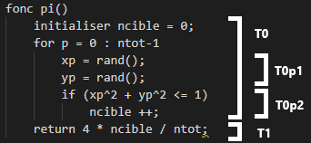
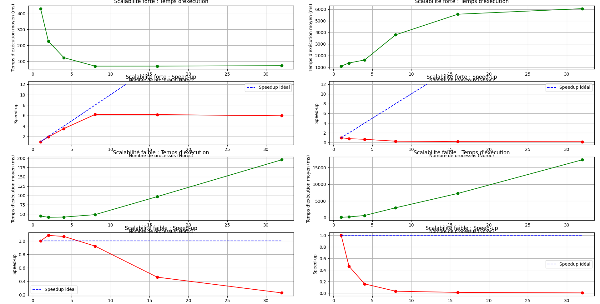

Florent VASSEUR--BERLIOUX
INF-FI3

<div align="center">


# Prog. Avancée - Compte rendu

</div>

Le document suivant est un résumé du cours de Programmation Avancée, illustrée par les exemples du TP.
Ce rapport expliquera aussi les choix effectuer dans les TP.

---

<br><br><br>

## Technique de Monte Carlo

Soit $$\( A_{c} = 1 \)$$ et un quart de disque de rayon $$\( r = 1 \)$$ :

$$
\[ A_{\text{quart disque}} = \frac{\pi r^2}{4} = \frac{\pi}{4} \]
$$

Soit $$\( l \$$) le côté d’un carré de côté $$\( l = 1 \)$$ :

$$
\[ A_{c} = r^2 = 1 \]
$$

Soit les points $$\( X_{i} \)$$ de coordonnées $$\((x, y)\)$$, sont tirés selon une loi uniforme sur $$\([0, 1]\)$$. La probabilité que $$\( X \)$$ soit tiré dans le quart de disque est :

$$
\[ P = \frac{A_{\text{quart disque}}}{A_{c}} = \frac{\pi/4}{1} = \frac{\pi}{4} \]
$$

### Représentation graphique


<i>**Sources :** [wikipedia.org](https://de.wikipedia.org/wiki/Datei:Pi_monte_carlo_all.svg) </i>


Tirages aléatoires dans un carré de côté $$\( n = 1 \)$$.

On effectue $$\( n_{tot} \)$$ tirages aléatoires. Soit $$\( n_{c} \$$) le nombre de points tirés dans le quart de disque.

Si $$\( n_{tot} \)$$ est grand, alors on peut approximer $$\( P \)$$ par :

$$
\[ P = \frac{n_c}{n_{tot}} \approx \frac{\pi}{4} \]
$$

D'où :

$$
\[ \pi \approx 4 \times \frac{n_c}{n_{tot}} \]
$$

<br>
<br>

### Algorithme Monte Carlo en parallélisme

L'algorithme peut être divisé en deux tâches principales :
- **T0** : Tirage et comptage des points dans le quart de disque.
- **T1** : Calcul de π.

La tâche **T0** peut être elle-même décomposée en deux sous-tâches :
- **T0p1** : Tirer aléatoirement les coordonnées `(xp, yp)`.
- **T0p2** : Incrémenter `n_cible` si le point appartient au quart de disque.


Les tâches **T0** et **T1** sont indépendantes : **T1** dépend uniquement du résultat final de **T0**.
Les itérations de la boucle **T0** sont indépendantes entre elles, ce qui permet une parallélisation facile.




<br>

## Assignement102

Ce code calcul une valeur appromimative de PI à partir de la technique de Monte Carlo.

<br>

### Dépendences :

Le code dépends de l'API conccurent et en utilise les concepts :
- Executors : La classe Executors permet l'impémentation d'un système distribué. Dans ce code, c'est la méthode Work-Stealing Pool de cette classe qui est utilisé. L'Executor a une collection de thread et une collection de tâches, il associe ces threads et tâches ensemble pour gérer l'exécution des tâches.
- AtomicInteger : La classe AtomicInteger permet la création d'un entier protéger des risques engendrés par la ressource critique. Cette classe permet d'éviter d'avoir à utilisé un zone `synchronized`.

<br>

**NOTE :** Utilisation d'Executor.
```java
new Tread(new RunnableTask()).start();
```
On substitue alors les threads par un Executor :
```java
Executor executor = myExecutor;
executor.execute(new RunnableTask1());
executor.execute(new RunnableTask2());
```
<br>

### Algorithme :

Assignement102 est un programme de paradigyme dit "d'itération parrallèle" ou encore de "parralélisme de boucles".
Il s'agit d'un algorithme parallèle calculant Pi à partir de la technique de Monte Carlo.

Dans le code, une instance de de la classe ``PiMonteCarlo`` est créée avec un nombre total de tirages (``nThrows``) et un nombre de processeurs (``nProcessors``).

Avec la méthode ``getPi()`` soumet ensuite des tâches parallèles à des threads, où chaque tâche est exécutée par un thread indépendant. Chaque thread génère deux coordonnées aléatoires, vérifie si elles tombent dans le quart de cercle et incrémente le compteur ``nAtomSuccess`` en cas de succès.

La parallélisation est appliquée en soumettant ces tâches à plusieurs threads, permettant ainsi à plusieurs points d'être traités simultanément. A partir des résultats renvoyer par les threads, on calcule finalement la valeur de π.

Cette approche permet de réduire le temps de calcul total et améliore l'efficacité de l'algorithme Monte-Carlo en exploitant la puissance de calcul disponible de la machine.

<br>

## Pi

Ce code calcul une valeur appromimative de PI à partir de la technique de Monte Carlo.

<br>

### Dépendences :

Le code dépends de l'API conccurent et en utilise les concepts :
- Executors : La classe Executors permet l'impémentation d'un système distribué. Dans ce code, c'est la méthode Work-Stealing Pool de cette classe qui est utilisé. L'Executor a une collection de thread et une collection de tâches, il associe ces threads et tâches ensemble pour gérer l'exécution des tâches.
- Future : La classe Future permet de représenter le résultat d'un calcul asynchrone. Cette classe est constituée des méthode isDone et get, permettant respectivement de vérifier si le calcul est fini, et de réccupérer le résultat du calcul.

<br>

### Algorithme :

Assignement102 est un programme de paradigyme dit "Master/Worker". Les tâches sont segmentées par le ``Master`` entre les différents ``Worker``.
Il s'agit d'un algorithme parallèle calculant Pi à partir de la technique de Monte Carlo.

Dans ce code, le parallélisme est appliqué pour améliorer l'efficacité de l'approximation de π à l'aide de la méthode Monte Carlo.
Le ``Master`` crée un certain nombre de tâches (``Worker``) correspondant au nombre de processus spécifié, chaque Wroker effectue une simulation de tirage de points et renvoie le nombre de points tombant à l'intérieur du quart de cercle.

Chaque tâche est une instance de ``Worker`` qui réalise les tirages et calcule le nombre de points à l'intérieur du cercle. Le programme ``Master`` attend les résultats de toutes les tâches en utilisant une instance de la classe ``Futur`` pour gérer la zone critique.

Ce mode de fonctionnement permet une parallélisation efficace du calcul de Monte Carlo en exploitant la puissance des threads pour diviser le problème en plusieurs sous problèmes.


<br>

## Envoi de messages

Uns socket est un fichier contenant des informations. Il s'agit d'un paquet d'octets avec des informations sur la source et le destinataire d'une donnée.

On se base sur le code distributedMC_step1_javaSocket présent dans le fichier src2.
On exécute le code en attribuant des numéros de ports à chaque Worker, puis on execute le Master en lui indiquant les ports des Workers.

On peut exécuter ce code en ligne de dommande dans le terminal :

**D'abord on compile avec javac.**
```bash
javac WorkerSocket.java
```


```bash
javac MasterSocket.java
```

**Ensuite on exécute en plaçant les arguments dans l'appel.**

```bash
java WorkerSocket 25545
```

```bash
java MasterSocket
```

Le programme n'est pas complet, il faut donc lui ajouté la partie du calcul de MonteCarlo.
Dans le fichier WorkerSocket, on peut donc ajouter le code du programme Pi.java :

```java
long circleCount = 0;
Random prng = new Random();
for (int j = 0; j < parseInt(str); j++)
{
    double x = prng.nextDouble();
    double y = prng.nextDouble();
    if ((x * x + y * y) < 1)  ++circleCount;
}
pWrite.println(""+circleCount);
```

On utilise pWrite pour écrire le résultat calculé par le Worker dans la Socket.
Ainsi, le Master reçoit les informations et peut calculer le résultat final.
 
### Algorithme :

Ce code se compose de deux classes, ``MasterSocket`` et ``WorkerSocket``, qui mettent en œuvre une version distribuée de la méthode de Monte Carlo pour l'estimation de π via des sockets réseau.

``MasterSocket`` envoie du travail au nombre de ``Worker`` spécifié. Chaque ``Worker`` est responsable d'une portion des simulations de tirage de points.
Le ``MasterSocket`` envoie une charge de travail divisée entre les ``Workers`` via les ports spécifiés, puis attend les résultats de chaque ``Worker`` avant de calculer la valeur de π.

Chaque ``Worker`` dans ``WorkerSocket`` écoute sur son port attribué, reçoit le nombre de points à simuler et effectue les calculs de Monte Carlo pour déterminer le nombre de points tombant à l'intérieur d'un quart de cercle. Il renvoie finalement son résultat vers le ``Master``.

Il s'agit du même algorithme que le code "Pi", mais ici, la communication entre les processus se fait via des sockets réseau, permettant une parallélisation distribuée.

 Ce mode de fonctionnement permet une parallélisation efficace du calcul de Monte Carlo en répartissant la charge de travail entre plusieurs machines, améliorant ainsi la performance globale du calcul.

<br>

## Test des temps d'exécutions

<br>

### Assignement102

On a testé le temps d'exécution de l'algorithme en fonction du nombre de points utilisés. On compare alors les temps d'exécutions pour vérifiées à partir de quelle valeur le temps d'exécution devient significatif.

| Nombre de points | Temps d'exécution | Précision|
|-----------------|-------------------|-----------|
| 10^3            | 0 ms             | 10^-1      |
| 10^4            | < 40 ms          | 10^-1      |
| 10^5            | ~ 40 ms           | 10^-2     |
| 10^6            | ~ 130 ms          | 10^-4     |
| 10^7            | ~ 1300 ms         | 10^-4     |

On en conclue que l'algorithme est efficace pour des valeurs de points supérieures à 10^6.

De ce fait, on utiliseras un nombre de point supérieur à 10 millions pour nos futurs tests.

<br><br>

### Pi

Comme pour le code précédent, on a testé le temps d'exécution de l'algorithme en fonction du nombre de points utilisés. On compare alors les temps d'exécutions pour vérifiées à partir de quelle valeur le temps d'exécution devient significatif.

| Nombre de points | Temps d'exécution | Précision|
|-----------------|-------------------|-----------|
| 10^3            | 0 ms             | 10^-1      |
| 10^4            | < 50 ms          | 10^-1      |
| 10^5            | < 50 ms           | 10^-2     |
| 10^6            | ~ 90 ms          | 10^-4     |
| 10^7            | ~ 1000 ms         | 10^-5     |

Une nouvelle fois, on en conclue que l'algorithme est efficace pour des valeurs de points supérieures à 10^6.

De ce fait, on utiliseras un nombre de point supérieur à 10 millions pour nos futurs tests.

<br><br>

## Scalabilité partagée

On a testé la scalabilité de l'algorithme en fonction du nombre de points utilisés.

Pour l'image ci dessous, les graphes de gauches concernent l'algorithme Pi et les graphes de droites concernent l'algorithme Assignement102.
Les graphiques dont les lignes sont vertes sont les résultats des temps d'exécution, ceux dont les lignes sont rouges sont les speedups.
On a, la scalabilité forte en haut, et la scalabilité faible en bas.



<br>

### Analyse de la Scalabilité forte

On constate que l'algorithme Pi est plus efficace que l'algorithme Assignement102.
En effet, pour la scalabilité forte le speedup de Pi est plus proche du speedup idéal que celui de Assignement102.

On remarque par exemple que le speedup de l'algorithme Pi suit la droite de speedup idéal jusqu'à 8 processus. Ceci s'explique par le fait que la machine sur laquelle on a effectué les tests possède 8 coeurs. Après 8 processus, le speedup de l'algorithme Pi stagne et decroche de la dorite de speedup idéal.

Pour Assignement102, on remarque que le speedup est catastrophique. En effet, le speedup est toujours inférieur à 1, ce qui démontre la mauvaise scalabilité forte de l'algorithme. L'augmentation du nombre de processus n'améliore pas le temps d'exécution, et le fait même empirer.

<br>

### Analyse de la Scalabilité faible

Pour la scalabilité faible, on remarque que le speedup des algorithmes Pi et Assignement102 est toujours inférieur à 1.
On remarque cependant que Pi dépasse légerment 1 pourn 2 et 4 processus. Il s'agit vraisemblablement d'une marge d'erreur générée lors des tests.
On peut expliquer cette marge d'erreur par l'execution d'un autre  processus sur la même machine au moment des tests. Le reste de la courbe est cohérente et indique que la scalabilité faible de l'algorithme Pi est, certe meilleure que celle de l'algorithme Assignement102, mais a tout de même une tendance décroissante.

Concernant  l'algorithme Assignement102, on remarque que le speedup est toujours inférieur à 1, ce qui démontre la mauvaise scalabilité faible de l'algorithme. En effet, sa scalabilité faible est encore plus mauvaise que celle de l'algorithme Pi.

<br>

### Efficacité sous la norme ISO

On définit alors pour nos temps d'executions, leur rapport avec les normes imposé par l'ISO 25022 et l'ISO 25010.
On constate que l'on peut différencier deux façon d'interpréter la norme d' *Efficiency*. On peut considérer l'évolution du temps d'execution par rapport au temps sur d'execution sur le programme à 1 processus (code séquentiel), ou la différence entre le speedup idéal et le speedup actuel pour obtenir l'erreur. Attention, sur le premier cas, on cherche un nombre le plus grand possible pour valider la norme, alors que dans le second, on cherche un nombre le plus faible possible.

Dans le premier cas, nous comparons notre code parallèle avec le code séquentiel en posant :

$$
T_1 = T_t \quad \text{et} \quad T_a = T_p
$$

Dans le deuxième cas, nous considèrons un parallélisme idéal où le temps d'exécution pour \( p \) processus est donné par \( T_p = T_t \), et \( T_a = \hat{T_p} \), où \( \hat{T_p} \) est le temps d'exécution mesuré sur \( p \) processus. Le temps idéal en scalabilité forte est :

$$
T_p = p T_1
$$

Nous évaluons ensuite l'écart entre le temps réel \( \hat{T_p} \) et le temps idéal \( T_p \).

<br>

### Conclusion sur la scalabilité

On peut conclure que l'algorithme Pi est plus efficace que l'algorithme Assignement102. Sa scalabilité, faible comme forte, est meilleure que celle de l'algorithme Assignement102. Cela s'explique par le fait que l'algorithme Pi est de paradygme Master/Worker, ce qui permet d'exploiter pleinement les ressources de la machine.

En ce qui concerne l'algorithme Assignement102, sa scalabilité est très mauvaise, et celà se ressent lors de l'exécution du programme. Cela s'explique par le fait que l'algorithme Assignement102 est de paradygme d'itération parralèle, ce qui ne permet pas d'exploiter pleinement les ressources de la machine. L'accès trop fréquent à la ressource critique (nAtomSuccess) rends le programme très lent.

L'analyse de la scalabilité de l'algorithme Assignement102 est compliqué et fastidieuse car sa faible scalabilité rends les tests très longs.

<br><br>

## Scalabilité partagée

<br><br>

## Evaluation numérique


<br><br>
